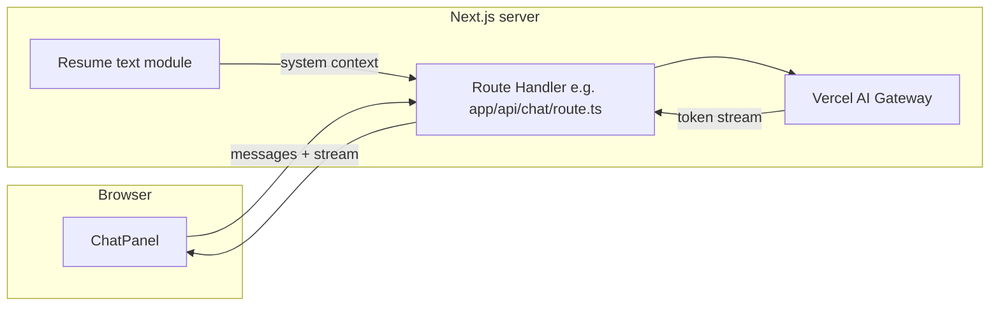

# Step 2 — Basic Agent Q&A (spec)

**Version:** v0.2  
**Date:** March 2026  
**Parent:** [implementation-plan.md](../implementation-plan.md) Step 2  
**Product context:** [joel-personal-site-overview.md](../joel-personal-site-overview.md)

---

## 1. Goal

Ship **live chat** in the right panel: user messages are sent to a **Next.js Route Handler** using the **Vercel AI SDK** and **[Vercel AI Gateway](https://vercel.com/docs/ai-gateway)** . The server uses `**streamText`** (per AI Gateway + AI SDK docs) so responses **stream** into the UI. The model receives **Joel’s resume text as system context** and answers questions **conversationally**, using that content as the source of truth.

**Why Gateway:** One integration path, unified routing/billing in the Vercel dashboard, and you pick a concrete model via a `**provider/model`** string (e.g. `openai/gpt-4o`) without installing per-provider packages for Step 2.

**Explicitly not in this step:** changing the left-panel resume presentation, detecting “restyle” intent, structured tool calls, version history, guardrails beyond a minimal system prompt, or fetching the resume from an external URL (that is Step 6).

---

## 2. Success criteria

- A server-side route streams a chat completion **through AI Gateway** to the client (via `streamText` + the same streaming response pattern the `useChat` client hook expects).
- The chat panel shows the user’s messages and the assistant’s reply **as it streams** (not only after completion).
- Resume text used by the model is the **same canonical source** used to render the left panel (single file in repo until Step 6).
- `AI_GATEWAY_API_KEY` exists only on the server / Vercel env — **never** shipped to the browser. (On Vercel, you may alternatively use **OIDC** keyless auth for Gateway; see Vercel’s AI Gateway authentication docs.)
- Obvious failure when the API errors (message or inline error state), without silent no-ops.

---

## 3. Architecture

- **Client:** `ChatPanel` (or a thin wrapper) uses the AI SDK **React** integration (`useChat` or the current recommended hook for the installed `ai` major version) pointing at `/api/chat` (path adjustable; keep a single constant).
- **Server:** Route Handler validates input, builds messages with a **fixed system prompt** + injected resume string, calls `**streamText`** from `ai` with a **Gateway model id** (`provider/model` string, or `gateway('provider/model')` if using an explicit gateway instance — see [AI Gateway provider](https://sdk.vercel.ai/providers/ai-sdk-providers/ai-gateway)), and returns a streaming HTTP response in the format the client hook expects.

---

## 4. Dependencies and environment

| Item         | Notes                                                                                                                                                                                                                                                                                         |
| ------------ | --------------------------------------------------------------------------------------------------------------------------------------------------------------------------------------------------------------------------------------------------------------------------------------------- |
| **Packages** | Add `**ai`** and the React helpers required by the installed version (follow [Vercel AI SDK](https://sdk.vercel.ai/docs) + Next.js App Router chat examples). **No** `@ai-sdk/openai` (or other vendor SDK) is required for Step 2 if you use Gateway model strings only.                     |
| **Env**      | `**AI_GATEWAY_API_KEY`** in `.env. locally; create a key in the Vercel dashboard ([AI Gateway API Keys](https://vercel.com/docs/ai-gateway)). For production on Vercel, prefer dashboard env vars or **OIDC**-based Gateway auth where applicable.                                      |
| **Model**    | Pass a `**provider/model`** id (e.g. `openai/gpt-4o`, `anthropic/claude-…`) — see [Gateway models](https://vercel.com/docs/ai-gateway/models-and-providers). Optional env var (e.g. `AI_GATEWAY_MODEL`) for switching without code changes; otherwise a single constant in the route is fine. |

**Reference:** [Text generation quickstart (AI Gateway)](https://vercel.com/docs/ai-gateway/getting-started/text) shows `streamText` with a model string; align the chat route with the **chat + streaming** pattern from the AI SDK Next.js docs.

---

## 5. Resume content (canonical file)

- **Until Step 6:** Maintain **one** resume document in the repo (markdown or plain text is fine).
- **Server:** Import or `fs.readFileSync` at build/runtime only on the server (prefer **import** of a `.md` / `.txt` if bundling is simpler than filesystem paths in serverless).
- **Client (left panel):** `ResumePanel` should render from the **same** source: either import the same module and render HTML from markdown on the client, or import pre-rendered HTML string — **one module** should be the single source of truth to avoid drift.
- **Step 2 extraction:** If the resume today is inline JSX in `resume-panel.tsx`, refactor minimally: move body copy into the shared file and render it in `ResumePanel` (still unstyled / browser-default rules per product spec).

---

## 6. System prompt (minimal)

Requirements the prompt should encode:

- You are helping visitors learn about Joel’s background **from the attached resume only**.
- Answer clearly and conversationally; prefer accuracy over speculation.
- If something is not in the resume, say so instead of inventing facts.
- **Do not** output HTML/CSS to change the resume layout in this step (Step 3 will add restyling). Optionally add one line: “Do not offer to restyle the page yet” to reduce confusion until Step 3.

Full prompt text can live in `src/` next to the route or in a small `lib/` module.

---

## 7. API contract

- **Method:** `POST` to the chat route.
- **Body:** Use the default shape expected by `useChat` for the chosen SDK version (typically `messages` array with `role` + `content` parts).
- **Response:** Streaming response compatible with the client hook (do not roll a custom SSE format unless paired with a custom transport).

**Validation:** Reject empty or absurdly large payloads with `4xx` (e.g. Zod) to protect the route.

---

## 8. Chat UI integration (`chat-panel.tsx`)

Current state: mock messages, `handleSend` no-op, mode toggles (`qa` / `restyle`).

**Step 2 behavior:**

- Replace static history with **live** messages from the chat hook.
- **Streaming:** Show partial assistant text as it arrives (hook + default streaming behavior).
- **Loading:** Show a clear pending state while waiting for the first token (spinner or “thinking” line consistent with IDE styling).
- **Mode selector:** Until Step 3, either:
  - **Option A (recommended):** Keep UI but document that **all modes use the same Q&A path** for now; restyle is inactive, or
  - **Option B:** Disable or hide “Restyle” / “Auto” to avoid misleading copy.

Align message **roles** with the SDK (`assistant` vs current `agent` label): keep the visual design; map `assistant` → existing “agent” styling.

---

## 9. Errors and edge cases

| Case                                                         | Behavior                                                                          |
| ------------------------------------------------------------ | --------------------------------------------------------------------------------- |
| Missing / invalid `AI_GATEWAY_API_KEY` (when not using OIDC) | Log server-side; return `500` with a generic message; client shows a short error. |
| Gateway or upstream model error / rate limit                 | User-visible error; optional single retry is not required for Step 2.             |
| User sends empty message                                     | Already prevented client-side; server should still validate.                      |

---

## 10. Security and abuse (Step 2 baseline)

- No Gateway API key in client bundles or `NEXT_PUBLIC_`* vars.
- Rely on Vercel AI Gateway / account limits; **no** custom rate limiting required for MVP unless you expose the site publicly and see abuse.

---

## 11. Testing checklist (manual)

- Local: send a question whose answer appears in the resume; verify accuracy.
- Ask something **not** in the resume; verify the model declines or says it’s not listed.
- Invalid or missing key briefly; verify error UI.
- Confirm streamed tokens appear progressively in the chat panel.

---

## 12. Follow-on steps (out of scope here)

- **Step 3:** Structured output or second stream for HTML/CSS, restyle detection, left-panel swap.
- **Step 5:** Guardrails and off-topic redirects per product spec.
- **Step 6:** Replace file import with fetch from external URL at load time.

---

## 13. File / area touch list (expected)

| Area                                            | Action                                                                               |
| ----------------------------------------------- | ------------------------------------------------------------------------------------ |
| `src/package.json`                              | Add `ai` (+ React helper packages as required by the SDK version you install).       |
| `src/app/api/chat/route.ts` (or `.../route.ts`) | New Route Handler — `streamText` via AI Gateway model id, adapt stream to `useChat`. |
| `src/content/resume.`* or similar               | New canonical resume file (if extracting from `resume-panel.tsx`).                   |
| `src/components/resume-panel.tsx`               | Read from shared resume source.                                                      |
| `src/components/chat-panel.tsx`                 | Wire `useChat`, streaming, send, errors; adjust mode UX per §8.                      |
| `.env.example`                                  | Document `AI_GATEWAY_API_KEY` and optional `AI_GATEWAY_MODEL` (or equivalent).       |

Exact paths may be adjusted to match project conventions; keep the **single resume source** invariant.