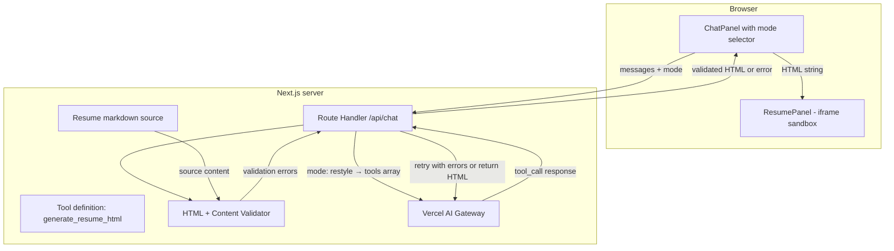
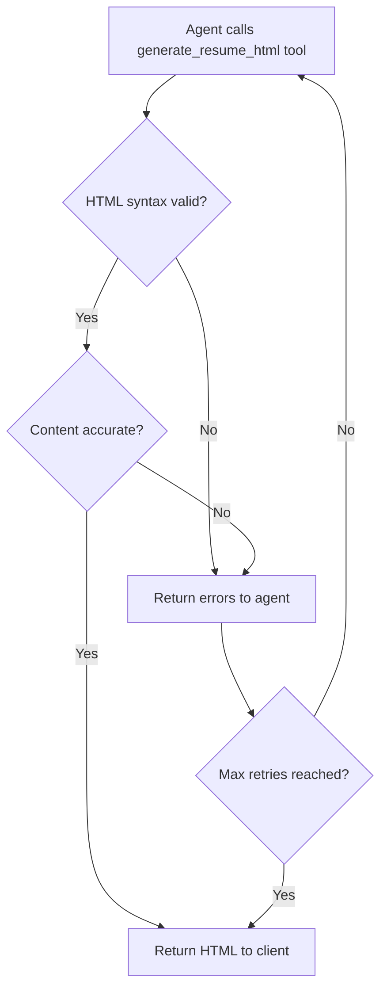

# Step 3 — AI-driven UI Restyling (spec)

**Version:** v0.1  
**Date:** March 2026  
**Parent:** [implementation-plan.md](../implementation-plan.md) Step 3  
**Product context:** [joel-personal-site-overview.md](../joel-personal-site-overview.md)  
**Prerequisite:** [basic-agent.md](./basic-agent.md) (Step 2)

---

## 1. Goal

Extend the agent to **detect restyle requests** and return **generated HTML** that presents the resume content in a requested theme or layout. The left panel swaps from unstyled HTML into the agent's rendered HTML/CSS inside a **sandboxed iframe**. Content accuracy is validated against the source markdown — the agent may not fabricate experience or alter facts.

**What changes from Step 2:**

- Chat requests now include a `**mode`** field (`"qa"` or `"restyle"`) set by the mode selector in the UI.
- When `mode: "restyle"`, the agent uses **tool calling** to return structured HTML.
- Generated HTML is **validated** for syntax correctness and **content accuracy** before being applied.
- The left panel renders the HTML in an **iframe sandbox** to isolate it from the parent page.

**Explicitly not in this step:** version history/undo (Step 4), content guardrails beyond accuracy validation (Step 5), external resume URL (Step 6).

---

## 2. Success criteria

- User selects **"Restyle" mode** in the chat panel, sends a theme request (e.g. "Make it look like a LinkedIn profile").
- The agent **calls a tool** (e.g. `generate_resume_html`) that returns a JSON object with an `html` string field.
- Server **validates HTML syntax** — if malformed, the agent receives error feedback and retries.
- Server **validates content accuracy** — compares facts in generated HTML against the source resume markdown to detect fabricated experience.
- If validation passes, the server returns the HTML to the client.
- Client renders the HTML in a **sandboxed iframe** in the left panel (replacing unstyled HTML).
- In **"Q&A" mode**, behavior is unchanged from Step 2 (conversational answers, no tool calls).

---

## 3. Architecture




---

## 4. Request contract

### Client → Server

**Unchanged from Step 2:**

- `POST /api/chat` with `messages` array (Vercel AI SDK `useChat` format).

**New in Step 3:**

- Add a `**mode`** field to the request body: `"qa"` or `"restyle"`.
- The chat panel sets `mode` based on the selected tab/button state.

**Example payload:**

```json
{
  "messages": [
    { "role": "user", "content": "Make it look like a brutalist design portfolio" }
  ],
  "mode": "restyle"
}
```

### Server behavior based on mode


| Mode        | Behavior                                                                                                                                        |
| ----------- | ----------------------------------------------------------------------------------------------------------------------------------------------- |
| `"qa"`      | Use Step 2 behavior: system prompt + resume context, conversational `streamText`, no tools.                                                     |
| `"restyle"` | Add `tools` array to `streamText` call with `generate_resume_html` tool definition. Agent may call the tool; server validates and returns HTML. |


---

## 5. Tool definition: `generate_resume_html`

Define a tool using the AI SDK's tool calling pattern. The agent calls this when it wants to generate a restyled resume.

**Tool schema:**

```typescript
{
  name: "generate_resume_html",
  description: "Generate a complete HTML document that presents Joel's resume content in the requested theme or layout. All content must be factually accurate and derived from the source resume. Include inline CSS in <style> tags and inline JavaScript in <script> tags if needed. Avoid external CDN libraries unless absolutely necessary - prefer vanilla HTML/CSS/JS. Return a complete, valid HTML5 document.",
  inputSchema: z.object({
    html: z.string().describe("Complete HTML5 document with inline CSS and JS"),
    theme_description: z.string().describe("Brief description of the applied theme for user confirmation"),
  }),
  execute: async ({ html, theme_description }) => {
    // Server-side validation (see §7)
    // Returns { success: true, html, theme_description } or { error: "..." }
  }
}
```

**Agent behavior:**

- When the user requests a restyle, the agent calls this tool with the generated HTML.
- The tool's `execute` function validates the HTML server-side before returning.
- If validation fails, the tool returns an error object and the agent can retry.
- After successful validation, the agent responds in chat with confirmation using the `theme_description` (e.g., "I've applied a brutalist portfolio design with bold typography and stark contrast.").

---

## 6. HTML generation requirements

### Format

- **Self-contained HTML5 document** with `<!DOCTYPE html>`, `<html>`, `<head>`, `<body>`.
- All **CSS** in `<style>` tags inside `<head>` or inline `style` attributes.
- All **JavaScript** (if needed) in `<script>` tags inside `<body>` or `<head>`.
- No external dependencies or imports (CDN libraries are allowed via `<script src="...">` or `<link>` tags if essential, but prefer vanilla HTML/CSS/JS).

### Content requirements

- The HTML must present **all** the factual content from the source resume markdown (name, roles, companies, dates, skills, descriptions, etc.).
- Creative interpretation of **layout, typography, colors, animations, structure** is encouraged.
- Fabricating experience, skills, or dates is **strictly prohibited** and will be caught by validation.

### Safety

- The HTML will be rendered in an **iframe sandbox** with restrictions (see §8).
- Avoid `document.cookie`, `localStorage`, `fetch` to external origins, or attempts to break out of the iframe.

---

## 7. Validation layer

The server must validate generated HTML **before** returning it to the client.

### 7.1 HTML syntax validation

**Goal:** Detect malformed HTML that would break rendering.

**Approach:** Use a lightweight HTML parser (e.g., `node-html-parser`, `parse5`, or `jsdom` with try/catch).

**On error:**

- Capture parse errors (e.g., unclosed tags, invalid nesting).
- Return errors to the agent in the tool response or as a follow-up message.
- Agent retries with corrected HTML (max 2-3 attempts).

**Example validation:**

```typescript
function validateHTMLSyntax(html: string): { valid: boolean; errors?: string[] } {
  try {
    const parsed = parse(html); // library-specific
    // Check for basic structure: html, head, body tags present
    if (!parsed.querySelector('html') || !parsed.querySelector('body')) {
      return { valid: false, errors: ['Missing required html or body tags'] };
    }
    return { valid: true };
  } catch (err) {
    return { valid: false, errors: [err.message] };
  }
}
```

### 7.2 Content accuracy validation

**Goal:** Ensure the generated HTML includes all factual resume content without fabrication.

**Validation strategy:** **Fuzzy matching** to balance strictness (prevent fabrication) with flexibility (allow creative phrasing).

**Approach:**

1. Extract **key facts** from the source resume markdown (e.g., company names, job titles, dates, skills, project names).
2. Extract **text content** from the generated HTML (strip tags, normalize whitespace).
3. Check that all key facts appear in the HTML text using **fuzzy matching rules**:
  - **Strict exact match required:** Company names, school names, certification names, dates (year portion)
  - **Fuzzy match allowed:** Job title variations (e.g., "Senior Software Engineer" matches "Senior Engineer" or "Sr. Software Engineer"), month abbreviations (e.g., "Jun" matches "June"), technology name variations (e.g., "React" matches "React.js")
4. Optionally: flag suspicious additions (entities in HTML not present in source).

**On error:**

- If critical content is missing or fabricated facts are detected, reject the HTML.
- Return specific errors to the agent (e.g., "Missing company name: HarperRand-CALRegional" or "Missing date: Jun 2023").
- Agent retries (max 2-3 attempts).

**Example validation logic:**

```typescript
function validateContentAccuracy(
  sourceMarkdown: string,
  generatedHTML: string
): { valid: boolean; errors?: string[] } {
  const sourceFacts = extractKeyFacts(sourceMarkdown); // companies, titles, dates, skills
  const htmlText = stripHTMLTags(generatedHTML);
  
  const missing = sourceFacts.filter(fact => !fuzzyMatch(fact, htmlText));
  if (missing.length > 0) {
    return {
      valid: false,
      errors: [`Missing required content: ${missing.join(', ')}`],
    };
  }
  
  return { valid: true };
}

function fuzzyMatch(fact: string, htmlText: string): boolean {
  // Normalize both strings (lowercase, trim, collapse whitespace)
  const normalizedFact = fact.toLowerCase().trim().replace(/\s+/g, ' ');
  const normalizedHTML = htmlText.toLowerCase().trim().replace(/\s+/g, ' ');
  
  // For strict facts (companies, schools, dates), require exact substring match
  if (isStrictFact(fact)) {
    return normalizedHTML.includes(normalizedFact);
  }
  
  // For flexible facts (job titles, tech names), allow partial matches or common variations
  // Example: "Senior Software Engineer" should match "Senior Engineer" or "Sr. Software Engineer"
  return normalizedHTML.includes(normalizedFact) || hasCommonVariation(normalizedFact, normalizedHTML);
}

function extractKeyFacts(markdown: string): string[] {
  // Extract: company names, job titles, degree names, skill names, dates
  // Implementation: regex or markdown parser to pull headings, list items, dates
  // Return array of strings that must appear in generated HTML
}
```

**Pragmatic tolerance:**

- Paraphrasing or reordering is acceptable as long as facts are preserved.
- Dates, proper nouns (companies, schools, technologies), and job titles must match exactly.

### 7.3 Validation retry loop




- Max **3 validation attempts** per restyle request.
- After 3 failed attempts, return a user-facing error: "Unable to generate a valid restyle. Please try a different theme."

---

## 8. Iframe sandbox

The left panel renders agent-generated HTML in an `<iframe>` with restrictive sandbox attributes.

### Sandbox configuration

```html
<iframe
  sandbox="allow-scripts"
  srcDoc={generatedHTML}
  style={{ width: '100%', height: '100%', border: 'none' }}
/>
```

**Allowed:**

- `allow-scripts`: JavaScript in `<script>` tags (for animations, interactivity).

**Blocked (by omission):**

- `allow-same-origin`: Forces iframe into a unique origin, preventing access to parent page, cookies, or storage.
- `allow-top-navigation`: Prevents iframe from navigating the parent page.
- `allow-forms`: Blocks form submission.
- `allow-popups`: Blocks `window.open()`.
- `allow-modals`: Blocks `alert()`, `confirm()`, `prompt()`.

**Security notes:**

- The iframe runs in a **unique origin** (null origin), completely isolated from the parent page.
- JavaScript can run for animations and interactivity, but cannot access `window.parent`, cookies, localStorage, or make same-origin fetch requests.
- This prevents the iframe from removing its own sandbox or manipulating the parent document.

---

## 9. System prompt updates

The system prompt must change based on the request mode.

### Q&A mode prompt (unchanged from Step 2)

```
You are helping visitors learn about Joel's background from the attached resume only.
Answer clearly and conversationally; prefer accuracy over speculation.
If something is not in the resume, say so instead of inventing facts.
Do not offer to restyle the page in Q&A mode.
```

### Restyle mode prompt (new)

```
You are helping a visitor visualize Joel's resume in a requested theme or layout style.

When the user requests a restyle:
1. Use the generate_resume_html tool to return a complete HTML5 document.
2. Include all factual content from Joel's resume (roles, companies, dates, skills, descriptions).
3. Be creative with layout, typography, colors, animations, and structure to match the requested theme.
4. Use inline CSS (<style> tags) and inline JavaScript (<script> tags) for all styling and interactivity.
5. Prefer vanilla HTML/CSS/JS - avoid external CDN libraries unless absolutely necessary.
6. Do not fabricate or alter any factual content (job titles, dates, company names, skills, etc.).
7. After calling the tool, respond in chat with a brief confirmation of the applied theme.

The resume content you must preserve:
{RESUME_MARKDOWN_CONTENT}

Themes can be humorous, unconventional, or highly stylized — but facts must remain accurate.
```

---

## 10. API route implementation flow

### Pseudocode

```typescript
export async function POST(req: Request) {
  const { messages, mode } = await req.json();
  
  // Validate mode
  if (!['qa', 'restyle'].includes(mode)) {
    return new Response('Invalid mode', { status: 400 });
  }
  
  // Build system prompt based on mode
  const systemPrompt = mode === 'qa' 
    ? buildQAPrompt(resumeMarkdown)
    : buildRestylePrompt(resumeMarkdown);
  
  // Build tool definitions (only for restyle mode)
  const tools = mode === 'restyle' ? {
    generate_resume_html: {
      description: "Generate a complete HTML document that presents Joel's resume content in the requested theme or layout. All content must be factually accurate. Include inline CSS in <style> tags and inline JavaScript in <script> tags if needed. Prefer vanilla HTML/CSS/JS - avoid CDN libraries unless absolutely necessary.",
      inputSchema: z.object({ 
        html: z.string().describe("Complete HTML5 document with inline CSS and JS"),
        theme_description: z.string().describe("Brief description of the applied theme for user confirmation"),
      }),
      execute: async ({ html, theme_description }) => {
        // Validation layer (see §12 for implementation details)
        const syntaxResult = validateHTMLSyntax(html);
        if (!syntaxResult.valid) {
          return { error: `HTML syntax errors: ${syntaxResult.errors.join(', ')}` };
        }
        
        const contentResult = validateContentAccuracy(resumeMarkdown, html);
        if (!contentResult.valid) {
          return { error: `Content validation failed: ${contentResult.errors.join(', ')}` };
        }
        
        // Validation passed
        return { success: true, html, theme_description };
      },
    },
  } : undefined;
  
  // Call streamText with AI Gateway
  const result = streamText({
    model: gateway('openai/gpt-4o'), // or env var
    system: systemPrompt,
    messages,
    tools,
    maxSteps: 5, // Allow up to 5 tool call attempts (3 retries)
  });
  
  return result.toDataStreamResponse();
}
```

### Key points

- **Mode routing:** The `mode` field determines whether tools are available.
- **Tool execution:** The `execute` function runs server-side **synchronously** during the agent loop.
- **Retry loop:** If validation fails, the tool returns an error object; the agent sees the error and can retry.
- **Max steps:** Set `maxSteps` to allow multiple tool call attempts (e.g., 5 = initial call + 2-3 retries + final message).

---

## 11. Client-side integration

### 11.1 Chat panel changes

**File:** `src/components/chat-panel.tsx`

**Required changes:**

1. Add `mode` state tracking (synced with the mode selector UI).
2. Pass `mode` in the request body to `/api/chat`:

```typescript
const { messages, input, handleSubmit, ... } = useChat({
  api: '/api/chat',
  body: {
    mode: selectedMode, // 'qa' or 'restyle'
  },
});
```

1. **Extract tool results** from assistant messages:
  - When the agent calls `generate_resume_html`, the AI SDK returns a message with `toolInvocations`.
  - Extract the `html` string from the successful tool result.
  - Pass it to the `ResumePanel` component for rendering.

**Example tool result extraction:**

Based on Vercel AI SDK's typed tool parts structure (using `@ai-sdk/react`):

```typescript
// In a useEffect watching messages:
useEffect(() => {
  const lastMessage = messages[messages.length - 1];
  if (lastMessage?.role === 'assistant') {
    for (const part of lastMessage.parts) {
      // Tool parts have type 'tool-{toolName}' and states: input-streaming, input-available, output-available, output-error
      if (part.type === 'tool-generate_resume_html' && part.state === 'output-available') {
        const result = part.output; // { success: true, html: "...", theme_description: "..." }
        if (result.success && result.html) {
          setGeneratedHTML(result.html);
        }
      }
    }
  }
}, [messages]);
```

**Key details:**

- Tool parts are typed as `tool-{toolName}` (e.g., `tool-generate_resume_html`)
- Use `part.state === 'output-available'` to access `part.output`
- The `output` field contains whatever the tool's `execute` function returned
- Tool parts also have states: `input-streaming`, `input-available`, `output-error` for displaying loading/error states

### 11.2 Resume panel changes

**File:** `src/components/resume-panel.tsx`

**Current state:** Renders unstyled HTML from the markdown source.

**Step 3 behavior:**

- Accept an optional `generatedHTML` prop (string | null).
- If `generatedHTML` is null, render the default unstyled HTML (Step 2 behavior).
- If `generatedHTML` is a string, render it in a **sandboxed iframe**:

```typescript
interface ResumePanelProps {
  generatedHTML?: string | null;
}

export function ResumePanel({ generatedHTML }: ResumePanelProps) {
  if (generatedHTML) {
    return (
      <iframe
        sandbox="allow-scripts"
        srcDoc={generatedHTML}
        style={{ width: '100%', height: '100%', border: 'none' }}
        title="Restyled resume"
      />
    );
  }
  
  // Default: unstyled HTML from markdown source
  return <div dangerouslySetInnerHTML={{ __html: defaultResumeHTML }} />;
}
```

**Security notes:**

- `sandbox` attribute isolates the iframe from the parent page in a unique origin.
- `srcDoc` renders the HTML inline (no external URL needed).
- Only `allow-scripts` is enabled for animations/interactivity; all other capabilities blocked.
- No `allow-same-origin` prevents the iframe from accessing parent page or storage.

---

## 12. Validation implementation details

### 12.1 HTML syntax validation

**Library recommendation:** `node-html-parser` (lightweight, server-friendly).

**Install:**

```bash
npm install node-html-parser
```

**Implementation:**

```typescript
import { parse } from 'node-html-parser';

function validateHTMLSyntax(html: string): { valid: boolean; errors?: string[] } {
  try {
    const root = parse(html);
    
    // Check for required structure
    if (!root.querySelector('html')) {
      return { valid: false, errors: ['Missing <html> tag'] };
    }
    if (!root.querySelector('body')) {
      return { valid: false, errors: ['Missing <body> tag'] };
    }
    
    // Parser succeeded
    return { valid: true };
  } catch (err) {
    return {
      valid: false,
      errors: [`HTML parsing failed: ${err.message}`],
    };
  }
}
```

### 12.2 Content accuracy validation

**Goal:** Verify that all key facts from the source resume appear in the generated HTML.

**Approach:**

1. **Extract facts** from the source markdown using regex or markdown parser:
  - Company names (e.g., "Anthropic", "OpenAI")
  - Job titles (e.g., "Senior Software Engineer")
  - Dates (e.g., "2020-2023", "June 2021")
  - Skills/technologies (e.g., "React", "Python", "AWS")
  - Education (degree names, institution names)
2. **Extract text** from generated HTML (strip all tags, normalize whitespace).
3. **Check presence** of each fact in the HTML text.
4. **Flag missing facts** as validation errors.

**Implementation sketch:**

```typescript
function validateContentAccuracy(
  sourceMarkdown: string,
  generatedHTML: string
): { valid: boolean; errors?: string[] } {
  const facts = extractKeyFacts(sourceMarkdown);
  const htmlText = stripHTMLTags(generatedHTML);
  
  const missing: string[] = [];
  for (const fact of facts) {
    if (!fuzzyMatch(fact, htmlText)) {
      missing.push(fact);
    }
  }
  
  if (missing.length > 0) {
    return {
      valid: false,
      errors: [
        'Missing required content from resume:',
        ...missing.map(f => `  - ${f}`),
      ],
    };
  }
  
  return { valid: true };
}

function fuzzyMatch(fact: string, htmlText: string): boolean {
  const normalizedFact = fact.toLowerCase().trim().replace(/\s+/g, ' ');
  const normalizedHTML = htmlText.toLowerCase().trim().replace(/\s+/g, ' ');
  
  // Strict match for companies, schools, certification names, dates
  if (isStrictFact(fact)) {
    return normalizedHTML.includes(normalizedFact);
  }
  
  // Fuzzy match for job titles and tech names - allow common variations
  return normalizedHTML.includes(normalizedFact) || hasCommonVariation(normalizedFact, normalizedHTML);
}

function isStrictFact(fact: string): boolean {
  // Identify facts that require exact matching
  // Examples: company names, school names, date patterns (YYYY-YYYY, YYYY)
  return /\d{4}/.test(fact) || // Contains year
         isKnownCompanyOrSchool(fact) || // From a list of known entities
         isKnownCertification(fact);
}

function hasCommonVariation(factNormalized: string, htmlNormalized: string): boolean {
  // Check for common title variations
  // "Senior Software Engineer" → ["Senior Engineer", "Sr. Software Engineer", "Sr Software Engineer"]
  // "React" → ["React.js", "ReactJS"]
  // Implementation: pattern matching or lookup table
  const variations = generateCommonVariations(factNormalized);
  return variations.some(v => htmlNormalized.includes(v));
}

function extractKeyFacts(markdown: string): string[] {
  // Extract company names, job titles, dates, skills
  // Example: use regex or markdown parser to pull:
  //   - Headings (## Company Name, ### Job Title)
  //   - Date patterns (YYYY-MM, YYYY-YYYY, "Jan 2020")
  //   - Skill lists (bullets under "Skills" section)
  //   - Education section content
  
  // Return array of strings (facts)
  const facts: string[] = [];
  
  // Extract company/title patterns from markdown headings
  const headingMatches = markdown.match(/^##+ .+$/gm) || [];
  facts.push(...headingMatches.map(h => h.replace(/^#+\s*/, '').trim()));
  
  // Extract dates (YYYY-YYYY, YYYY-MM formats)
  const dateMatches = markdown.match(/\b\d{4}(?:-\d{4}|\s*-\s*present|\s*-\s*\d{4})\b/gi) || [];
  facts.push(...dateMatches);
  
  // Extract skill names from lists
  // (Heuristic: lines starting with - or * in a "Skills" section)
  const skillSection = markdown.match(/## Skills[\s\S]*?(?=##|$)/i)?.[0] || '';
  const skillMatches = skillSection.match(/^[•\-*]\s*(.+)$/gm) || [];
  facts.push(...skillMatches.map(s => s.replace(/^[•\-*]\s*/, '').trim()));
  
  return facts.filter(Boolean); // Remove empty strings
}

function stripHTMLTags(html: string): string {
  // Remove all HTML tags, decode entities, normalize whitespace
  return html
    .replace(/<script\b[^<]*(?:(?!<\/script>)<[^<]*)*<\/script>/gi, '') // Remove script tags
    .replace(/<style\b[^<]*(?:(?!<\/style>)<[^<]*)*<\/style>/gi, '') // Remove style tags
    .replace(/<[^>]+>/g, ' ') // Remove all other tags
    .replace(/ /g, ' ')
    .replace(/&[a-z]+;/gi, ' ') // Decode common entities
    .replace(/\s+/g, ' ')
    .trim();
}
```

**Tuning:**

- Use **fuzzy matching** (see §7.2) to allow legitimate creative variations while preventing fabrication.
- **Strict matching** (exact substring) for: company names, school names, certification names, dates (year portion).
- **Fuzzy matching** (allow variations) for: job titles, technology names, month abbreviations.
- Job descriptions can be flexible (paraphrasing acceptable as long as facts are preserved).

---

## 13. Error handling


| Case                                    | Behavior                                                                                                                     |
| --------------------------------------- | ---------------------------------------------------------------------------------------------------------------------------- |
| HTML syntax validation fails            | Tool returns error object; agent retries. After 3 attempts, return user-facing error in chat.                                |
| Content validation fails                | Tool returns error object with specific missing/fabricated facts; agent retries. After 3 attempts, return user-facing error. |
| Agent doesn't call tool in restyle mode | Treat as Q&A fallback; no error. (Agent may choose to answer conversationally if request is ambiguous.)                      |
| Iframe rendering fails client-side      | Show error message in left panel: "Failed to render restyled resume. Please try another theme."                              |
| Missing `mode` field in request         | Default to `"qa"` mode (backward compatible with Step 2 if `mode` is not yet wired).                                         |


---

## 14. Chat panel UX for restyle

**Before generation:**

- User types restyle request (e.g., "Make it look like a newspaper").
- User clicks send; message appears in chat history.
- Loading indicator shows (same as Step 2).

**During generation:**

- Assistant message streams with confirmation text (e.g., "I'll create a newspaper-style layout for your resume...").
- Tool call happens server-side (not visible to user until result arrives).

**After generation:**

- Assistant message completes with theme confirmation (from `theme_description` field).
- Left panel **immediately updates** with the new HTML (no preview/approval step).
- If validation failed after max retries, show error message in chat; left panel remains unchanged.

---

## 15. Testing checklist (manual)

### Restyle mode

- Select "Restyle" mode in chat panel.
- Send a simple theme request (e.g., "Make it look like a terminal").
- Verify HTML is generated and applied to left panel in iframe.
- Inspect iframe sandbox attributes in browser DevTools.
- Verify all resume content (companies, titles, dates, skills) appears in the restyled HTML.
- Send a request that might cause the agent to fabricate content (e.g., "Add more impressive projects"); verify validation catches it.
- Send malformed HTML intentionally (for testing, manually trigger a bad tool call); verify syntax validation catches it and agent retries.

### Q&A mode (regression)

- Select "Q&A" mode.
- Ask a resume question; verify agent answers conversationally without calling tools.
- Verify left panel remains unstyled HTML (no iframe swap).

### Edge cases

- Send a restyle request with no clear theme (e.g., "Make it better"); verify agent asks for clarification or makes a reasonable choice.
- Rapidly switch between Q&A and Restyle modes; verify no state bleed.
- Refresh page after a restyle; verify left panel reverts to unstyled HTML (no version persistence yet — that's Step 4).

---

## 16. Dependencies


| Package            | Purpose                                           | Install command                |
| ------------------ | ------------------------------------------------- | ------------------------------ |
| `node-html-parser` | HTML syntax validation                            | `npm install node-html-parser` |
| `zod`              | Tool parameter schemas (if not already installed) | `npm install zod`              |


**Already installed from Step 2:** `ai`, React AI SDK helpers.

---

## 17. File / area touch list (expected)


| Area                                            | Action                                                                           |
| ----------------------------------------------- | -------------------------------------------------------------------------------- |
| `src/app/api/chat/route.ts`                     | Add `mode` handling, tool definition, validation layer, retry logic.             |
| `src/lib/agent-system-prompt.ts`                | Split into `buildQAPrompt()` and `buildRestylePrompt()` functions.               |
| `src/lib/validators/html-validator.ts` (new)    | HTML syntax validation function.                                                 |
| `src/lib/validators/content-validator.ts` (new) | Content accuracy validation function.                                            |
| `src/components/chat-panel.tsx`                 | Pass `mode` in request body, extract tool results, manage `generatedHTML` state. |
| `src/components/resume-panel.tsx`               | Add iframe rendering for `generatedHTML` prop.                                   |
| `src/package.json`                              | Add `node-html-parser`.                                                          |
| `.env.example`                                  | No new vars (same `AI_GATEWAY_API_KEY` from Step 2).                             |


---

## 18. Clarifications & design decisions

### Content validation strictness (RESOLVED)
**Decision:** Use **fuzzy matching** (see §7.2) to balance preventing fabrication with allowing creative phrasing.
- Strict exact match for: company names, school names, certification names, dates (year portion)
- Fuzzy match for: job title variations, month abbreviations, technology name variations
- Rationale: Strict substring matching on all facts would cause false rejections when agent creatively rephrases titles or uses abbreviations.

### HTML state management (RESOLVED)
**Decision:** Store `generatedHTML` state in **ChatPanel** component, passed as prop to **ResumePanel**.
- Rationale: Follows React data flow principles; ChatPanel is the source of truth for chat interactions and their results.

### Iframe height (DEFERRED)
The iframe will need height management if the generated HTML is taller than the viewport. For Step 3:
- Use scrollable container: Set left panel content area to `overflow-y: auto`, iframe at 100% height.
- Future: Use `postMessage` communication for dynamic height (out of scope for MVP).

### CDN library usage (RESOLVED)
**Decision:** Explicitly discourage CDN usage in system prompt.
- System prompt includes: "Prefer vanilla HTML/CSS/JS - avoid external CDN libraries unless absolutely necessary."
- Rationale: Keep generated HTML simple, fast-loading, and self-contained. Vanilla CSS animations and JavaScript are sufficient for most effects.

### Tool result structure (RESOLVED)
**Decision:** Based on AI SDK documentation, tool results are accessed via typed tool parts:
- Tool part type: `tool-generate_resume_html`
- Access pattern: `part.state === 'output-available'` to read `part.output`
- The `output` field contains the tool's `execute` function return value

---

## 20. Example restyle request flow

### User action

1. User selects **"Restyle"** mode in chat panel.
2. User types: "Make it look like a 1990s GeoCities page."
3. User clicks send.

### Server-side (API route)

1. Route receives `{ messages: [...], mode: "restyle" }`.
2. Builds restyle system prompt with full resume markdown.
3. Calls `streamText` with `generate_resume_html` tool.
4. Agent generates HTML with flashing GIFs, rainbow text, hit counter, etc.
5. Agent calls tool with `{ html: "...", theme_description: "1990s GeoCities aesthetic with animated backgrounds and visitor counter" }`.
6. Tool `execute` function runs:
  - **Syntax validation:** HTML parses successfully ✓
  - **Content validation:** All companies, titles, dates present ✓
7. Tool returns `{ success: true, html: "...", theme_description: "..." }`.
8. Agent completes with chat message: "I've applied a 1990s GeoCities aesthetic with animated backgrounds and a visitor counter!"
9. Server streams response to client.

### Client-side (chat panel + resume panel)

1. Chat message appears: "I've applied a 1990s GeoCities aesthetic..."
2. `chat-panel.tsx` detects tool result in last assistant message.
3. Extracts `html` string, updates state: `setGeneratedHTML(html)`.
4. `resume-panel.tsx` receives new `generatedHTML` prop.
5. Re-renders with iframe: `<iframe sandbox="allow-scripts" srcDoc={generatedHTML} />`.
6. Left panel now shows the GeoCities-themed resume.

---

## 18. Clarifications & Design Decisions

### Content validation strictness (RESOLVED)
**Decision:** Use **fuzzy matching** (see §7.2) to balance preventing fabrication with allowing creative phrasing.
- **Strict exact match** for: company names, school names, certification names, dates (year portion)
- **Fuzzy match** for: job title variations, month abbreviations, technology name variations
- **Rationale:** Strict substring matching on all facts would cause false rejections when agent creatively rephrases titles or uses abbreviations.

### HTML state management (RESOLVED)
**Decision:** Store `generatedHTML` state in **ChatPanel** component, passed as prop to **ResumePanel**.
- **Rationale:** Follows React data flow principles; ChatPanel is the source of truth for chat interactions and their results.

### CDN library usage (RESOLVED)
**Decision:** Explicitly discourage CDN usage in system prompt and tool description.
- Tool description includes: "Prefer vanilla HTML/CSS/JS - avoid CDN libraries unless absolutely necessary."
- **Rationale:** Keep generated HTML simple, fast-loading, and self-contained. Vanilla CSS animations and JavaScript are sufficient for most effects.

### Tool result structure (RESOLVED)
**Decision:** Based on Vercel AI SDK v5+ documentation, tool results are accessed via typed tool parts:
- Tool part type: `tool-generate_resume_html`
- Access pattern: `part.state === 'output-available'` to read `part.output`
- The `output` field contains the tool's `execute` function return value
- **Rationale:** AI SDK automatically types tool parts for compile-time safety; requires type guards for runtime access.

### Retry mechanism (RESOLVED)
**Decision:** Use `maxSteps: 5` in `streamText` to allow the agent up to 3 retry attempts after validation failures.
- **Calculation:** Initial tool call (1) + up to 3 retries (2-4) + final chat response (5) = 5 steps
- **Error handling:** If all attempts fail, the tool's execute function should return an error object on the final attempt, and the agent should respond in chat with a user-facing error message.

### Resume file path resolution (RESOLVED)
**Decision:** Current path logic is correct - `process.cwd()` returns `/src` in this Next.js setup.
- File location: `/src/joel-resume.md`
- Code path: `join(process.cwd(), "joel-resume.md")` correctly resolves to `/src/joel-resume.md`
- **Rationale:** The working directory for the Next.js application is the `/src` folder.

---

## 19. Open questions / future work

- **Step 4:** Version history — save each `generatedHTML` snapshot to a state array, add ← → controls, persist to `localStorage`.
- **Step 5:** Content guardrails — add PG filter for inappropriate themes, off-topic redirects, friendly refusals.
- **Step 6:** External resume URL — fetch markdown from GitHub raw or similar at page load instead of using bundled file.

---

## 21. Risks and mitigations


| Risk                                           | Mitigation                                                                                                          |
| ---------------------------------------------- | ------------------------------------------------------------------------------------------------------------------- |
| Agent fabricates experience in creative themes | Fuzzy content validation layer (§7.2) rejects HTML with missing/fabricated facts; agent retries.                    |
| Malformed HTML breaks iframe rendering         | Syntax validation catches parse errors; agent retries.                                                              |
| Infinite retry loop if agent can't fix errors  | Cap at 3 attempts (via `maxSteps: 5` in streamText); return user-facing error in chat after max retries.           |
| Fuzzy validation too strict (false rejections) | Use flexible matching for titles/tech names; tune variation patterns based on testing results.                      |
| Fuzzy validation too loose (allows fabrication) | Maintain strict matching for critical facts (companies, schools, dates); monitor for false passes.                 |
| Iframe escapes sandbox                         | Use restrictive sandbox attributes; do not add `allow-same-origin`, `allow-top-navigation` or `allow-popups`.      |
| Generated HTML has XSS or malicious scripts    | Iframe sandbox mitigates; additionally, consider CSP headers on the iframe (optional for Step 3).                   |
| Large HTML payloads (MB+ responses)            | Set reasonable token limits on model responses; monitor and adjust if needed.                                       |
| TypeScript type errors with tool parts         | Use type guards to safely access tool parts; handle unexpected part types gracefully.                               |


---

## 22. Non-functional requirements

- **Performance:** HTML generation + validation should complete in < 10 seconds (model latency is the bottleneck; validation should be < 500ms).
- **Accessibility:** Iframe must have `title` attribute for screen readers. Generated HTML accessibility is best-effort (agent can be prompted to improve).
- **Browser support:** Modern browsers (Chrome, Firefox, Safari, Edge). No IE11 support required.

---

## 23. Definition of Done

- `/api/chat` route accepts `mode` field and conditionally provides `generate_resume_html` tool.
- `generate_resume_html` tool has complete server-side validation in its `execute` function.
- HTML syntax validation function implemented and tested.
- Content accuracy validation function with fuzzy matching implemented and tested.
- `maxSteps: 5` configured in streamText for retry support.
- Agent can generate HTML in restyle mode and retry on validation errors.
- `chat-panel.tsx` passes `mode` in request body and extracts tool results from typed message parts.
- `resume-panel.tsx` renders generated HTML in sandboxed iframe with `allow-scripts` only.
- Manual testing checklist (§15) complete.
- No version history or undo (deferred to Step 4).
- Q&A mode still works (regression test).

