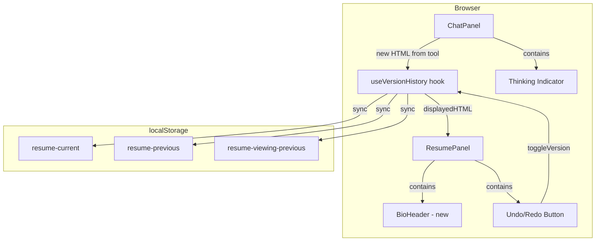

# Step 4 — UX Wrap-Up (spec)

**Version:** v0.1  
**Date:** March 2026  
**Parent:** [implementation-plan.md](../implementation-plan.md) Step 4  
**Product context:** [joel-personal-site-overview.md](../joel-personal-site-overview.md)  
**Prerequisite:** [restyling-agent.md](./restyling-agent.md) (Step 3)

---

## 1. Goal

Polish the user experience to reach a good MVP stopping point. This spec covers four key UX improvements:

1. **Undo/Redo functionality** - Simple two-state version control with localStorage persistence
2. **Enhanced thinking indicator** - Animated dots and elapsed time counter
3. **Bio/instructions section** - Welcoming header above the resume panel
4. **Prepopulated chat instructions** - Initial assistant message guiding users

**What changes from Step 3:**

- Resume panel gains an undo/redo button that replaces the `< >` arrows
- Chat loading state shows animated dots and a seconds counter
- Bio section appears above the resume content
- Chat starts with a helpful assistant message

**Explicitly not in this step:** Full version history with unlimited undo/redo (deferred to future enhancement, see [version-history.md](./version-history.md)), content guardrails (Step 5), external resume URL (Step 6).

---

## 2. Success criteria

### Undo/Redo
- Button is disabled on initial load
- Button enables after first restyle
- Clicking undo shows previous version and changes label to "Redo"
- Clicking redo shows current version and changes label to "Undo"
- New restyle while on current version: shifts current to previous
- New restyle while on previous version: appends to current, auto-switches view
- Page refresh preserves both versions in localStorage
- Page refresh preserves which version user was viewing

### Thinking Indicator
- Dots animate 1 → 2 → 3 → 1 in 3-second cycle
- Seconds counter starts at 0s and increments every second
- Counter displays for both Q&A and restyle modes
- Indicator disappears when response starts streaming
- Timer resets on new message

### Bio Section
- Displays above resume content
- Content is readable and styled appropriately
- Scrolls with resume panel
- Content is accurate and tone is appropriate

### Prepopulated Chat
- Initial assistant message appears on page load
- Message is styled like other assistant messages
- Content is clear and provides good guidance
- User can send messages normally after reading welcome message

---

## 3. Architecture



---

## 4. Feature 1: Undo/Redo Button

### 4.1 Goal

Replace the existing `< >` arrows in the top right of the resume panel with a single undo/redo button that toggles between the current and previous resume states.

### 4.2 Behavior

**Initial state (no restyle yet):**
- Button is **disabled** and labeled "Undo"
- No localStorage data exists yet

**After first restyle:**
- Button becomes **enabled** and labeled "Undo"
- localStorage contains:
  - `resume-current`: the new HTML string
  - `resume-previous`: the unstyled default HTML

**After clicking Undo:**
- Resume panel displays the previous HTML
- Button label changes to "Redo"
- States remain in localStorage (no swap yet)

**After clicking Redo:**
- Resume panel displays the current HTML
- Button label changes back to "Undo"

**After new restyle while viewing current version:**
- Previous state ← current state (shifted)
- Current state ← new HTML
- Button remains "Undo" (enabled)
- localStorage updated with both new values

**After new restyle while viewing previous version:**
- Same behavior - always append to current, shift current to previous
- Automatically displays the new current version
- Button remains "Undo" (enabled)

### 4.3 localStorage Schema

```typescript
// Three keys in localStorage:
{
  "resume-current": string | null,          // Current HTML (latest restyle)
  "resume-previous": string | null,         // Previous HTML (one version back)
  "resume-viewing-previous": "true" | "false" // Which version is displayed
}
```

### 4.4 Component Changes

**File:** `src/components/resume-panel.tsx`

- Add undo/redo button in top-right corner
- Replace `< >` arrows with single button
- Button states:
  - Disabled when no previous state exists
  - "Undo" when viewing current version (previous exists)
  - "Redo" when viewing previous version
- On click: toggle between current and previous

**State management:**
- Use `useVersionHistory` custom hook (see §4.5)
- Track: `currentHTML`, `previousHTML`, `isViewingPrevious` (boolean flag)
- Sync with localStorage on every state change

### 4.5 Custom Hook: useVersionHistory

Create a custom hook to encapsulate all undo/redo logic:

**File:** `src/lib/use-version-history.ts` (new)

```typescript
import { useState, useEffect } from 'react';

const STORAGE_KEY_CURRENT = 'resume-current';
const STORAGE_KEY_PREVIOUS = 'resume-previous';
const STORAGE_KEY_VIEWING = 'resume-viewing-previous';

export function useVersionHistory() {
  const [currentHTML, setCurrentHTML] = useState<string | null>(null);
  const [previousHTML, setPreviousHTML] = useState<string | null>(null);
  const [isViewingPrevious, setIsViewingPrevious] = useState(false);
  
  // Load from localStorage on mount
  useEffect(() => {
    try {
      const current = localStorage.getItem(STORAGE_KEY_CURRENT);
      const previous = localStorage.getItem(STORAGE_KEY_PREVIOUS);
      const viewing = localStorage.getItem(STORAGE_KEY_VIEWING);
      
      if (current) setCurrentHTML(current);
      if (previous) setPreviousHTML(previous);
      if (viewing === 'true') setIsViewingPrevious(true);
    } catch (err) {
      console.error('Failed to load version history from localStorage:', err);
    }
  }, []);
  
  // Sync to localStorage on state change
  useEffect(() => {
    try {
      if (currentHTML !== null) {
        localStorage.setItem(STORAGE_KEY_CURRENT, currentHTML);
      }
      if (previousHTML !== null) {
        localStorage.setItem(STORAGE_KEY_PREVIOUS, previousHTML);
      }
      localStorage.setItem(STORAGE_KEY_VIEWING, isViewingPrevious.toString());
    } catch (err) {
      console.error('Failed to save version history to localStorage:', err);
    }
  }, [currentHTML, previousHTML, isViewingPrevious]);
  
  const addVersion = (newHTML: string) => {
    setPreviousHTML(currentHTML); // Shift current to previous
    setCurrentHTML(newHTML);       // Set new as current
    setIsViewingPrevious(false);   // Switch to current view
  };
  
  const toggleVersion = () => {
    setIsViewingPrevious(!isViewingPrevious);
  };
  
  const displayedHTML = isViewingPrevious ? previousHTML : currentHTML;
  const canUndo = previousHTML !== null && !isViewingPrevious;
  const canRedo = previousHTML !== null && isViewingPrevious;
  
  return {
    displayedHTML,
    addVersion,
    toggleVersion,
    canUndo,
    canRedo,
    isViewingPrevious,
  };
}
```

### 4.6 Data Flow

```
User requests restyle
  ↓
Agent generates HTML
  ↓
chat-panel detects tool result
  ↓
Calls addVersion(newHTML)
  ↓
useVersionHistory updates state + localStorage
  ↓
resume-panel receives new displayedHTML prop
  ↓
User clicks undo/redo button
  ↓
Calls toggleVersion()
  ↓
resume-panel receives toggled displayedHTML
```

### 4.7 Edge Cases

| Case | Behavior |
|------|----------|
| Page refresh while viewing previous | Restore to viewing previous (stored in `resume-viewing-previous`) |
| localStorage quota exceeded | Fail gracefully, log error, disable undo/redo |
| Corrupted localStorage data | Clear and reset to default state |
| New restyle while on previous | Append to history, auto-switch to current |

---

## 5. Feature 2: Enhanced Thinking Indicator

### 5.1 Goal

Make the loading state more engaging and informative by showing animated dots and elapsed time.

### 5.2 Animation Pattern

```
0-1s:   "Thinking."
1-2s:   "Thinking.."
2-3s:   "Thinking..."
3-4s:   "Thinking."
...
```

Dot count cycles: 1 → 2 → 3 → 1 (repeating every 3 seconds)

### 5.3 Time Counter

Display elapsed seconds after the dots:

```
"Thinking... 5s"
```

**Behavior:**
- Counter starts at 0s when message is sent
- Updates every second
- Always displays even from 0s (as per user preference)
- Format: integer seconds with "s" suffix

### 5.4 Implementation

**File:** `src/components/chat-panel.tsx` (or separate `thinking-indicator.tsx` component)

**Approach:**
1. Track message send timestamp when user submits
2. Use `setInterval` to update both dot animation and counter every second
3. Clear interval when response starts streaming or on error

**Example:**

```typescript
const [thinkingElapsed, setThinkingElapsed] = useState(0);
const [dotCount, setDotCount] = useState(1);

useEffect(() => {
  if (isLoading) {
    const interval = setInterval(() => {
      setThinkingElapsed(prev => prev + 1);
      setDotCount(prev => prev === 3 ? 1 : prev + 1);
    }, 1000);
    
    return () => clearInterval(interval);
  } else {
    setThinkingElapsed(0);
    setDotCount(1);
  }
}, [isLoading]);

// Render: "Thinking" + ".".repeat(dotCount) + " " + thinkingElapsed + "s"
```

### 5.5 Visual Treatment

- Keep existing loading state styling
- Consider subtle color or animation to make it feel active
- Ensure it's visually distinct from regular messages

---

## 6. Feature 3: Bio/Instructions Section

### 6.1 Goal

Add a welcoming section above the resume panel that introduces Joel and explains the interactive nature of the site.

### 6.2 Placement

**Location:** Top of the left panel (resume panel), above the resume content

**Visual treatment:**
- Distinct from resume content (border, background color, or padding)
- Should feel like a "header" or "intro card"
- Scrolls with the resume content (not fixed)

### 6.3 Content

**Tone:** Lighthearted, engaging, professional but approachable

**Suggested structure:**

```markdown
## About Me

[Brief 2-3 sentence bio about Joel - who he is, what he does, what makes him interesting]

## Why This Exists

Since I'm not interested in becoming a purely frontend developer, I wanted to create something a bit different. Use the chat on the right to either:
- Ask questions about my experience and background
- Help me design a more compelling personal site by requesting UI redesigns

The preview panel will update in real-time based on your suggestions. Let's see what we can create together!
```

**Key messaging:**
- Who Joel is
- Why this format is interesting
- Clear call-to-action (ask questions OR redesign)
- Playful/collaborative tone

### 6.4 Implementation

**File:** `src/components/bio-header.tsx` (new)

Create a new component for the bio section.

**File:** `src/components/resume-panel.tsx` (update)

Add BioHeader above resume content:

```tsx
<div className="resume-panel">
  <BioHeader />
  <div className="resume-content">
    {/* existing iframe or unstyled HTML */}
  </div>
</div>
```

**Responsive behavior:**
- Always visible at top
- Scrollable if content is long
- Consider collapsible on mobile (future enhancement)

### 6.5 Content Source

**Decision:** Start with hardcoded content for MVP, make it configurable later.

**Open question:** Need Joel's actual bio text (2-3 sentences about who he is and what makes him interesting).

---

## 7. Feature 4: Prepopulated Chat Instructions

### 7.1 Goal

Provide clear guidance to visitors on how to interact with the chat interface, displayed as the first message from the assistant.

### 7.2 Format

Display as an **initial assistant message** in the chat history when the page first loads.

### 7.3 Content

**Tone:** Helpful, friendly, concise

**Suggested message:**

```
Hi! I'm here to help you learn about Joel's experience or help redesign this resume in real-time.

You can:
• Ask questions about Joel's background, skills, and experience
• Request a UI redesign (e.g., "Make it look like a LinkedIn profile" or "Style it like an 80s terminal")

What would you like to do?
```

**Key elements:**
- Greeting
- Two clear options (Q&A or restyle)
- Examples for inspiration
- Open-ended prompt

### 7.4 Implementation

**File:** `src/components/chat-panel.tsx` or parent page component

**Approach:**

```typescript
const initialMessages = [
  {
    id: 'welcome',
    role: 'assistant',
    content: 'Hi! I\'m here to help you learn about Joel\'s experience or help redesign this resume in real-time.\n\nYou can:\n• Ask questions about Joel\'s background, skills, and experience\n• Request a UI redesign (e.g., "Make it look like a LinkedIn profile" or "Style it like an 80s terminal")\n\nWhat would you like to do?',
  },
];

const { messages, input, handleSubmit } = useChat({
  api: '/api/chat',
  initialMessages, // Pass to useChat hook
  body: { mode: selectedMode },
});
```

### 7.5 Persistence Behavior

**Decision:** Always show the welcome message on page load (even on refresh). It provides important context and guidance.

---

## 8. Component Touch List

| Component | Changes |
|-----------|---------|
| `src/components/resume-panel.tsx` | Add undo/redo button (top right), add BioHeader component above resume |
| `src/components/chat-panel.tsx` | Add thinking indicator with dots + timer, add initial assistant message |
| `src/components/bio-header.tsx` (new) | Bio/instructions section component |
| `src/lib/use-version-history.ts` (new) | Custom hook for managing current/previous state + localStorage |
| `src/app/page.tsx` or parent | Wire up version state between chat and resume panels |

---

## 9. Integration Points

### 9.1 Resume Panel ← Chat Panel

When chat panel detects a successful restyle (tool result):

```typescript
// In chat-panel.tsx
useEffect(() => {
  const lastMessage = messages[messages.length - 1];
  if (lastMessage?.role === 'assistant') {
    for (const part of lastMessage.parts) {
      if (part.type === 'tool-generate_resume_html' && part.state === 'output-available') {
        const result = part.output;
        if (result.success && result.html) {
          // Call version history hook's addVersion
          addVersion(result.html);
        }
      }
    }
  }
}, [messages]);
```

### 9.2 Resume Panel ← Version History Hook

Pass version state down to resume panel:

```typescript
// In parent component (e.g., page.tsx)
const versionHistory = useVersionHistory();

return (
  <div className="layout">
    <ResumePanel 
      displayedHTML={versionHistory.displayedHTML}
      canUndo={versionHistory.canUndo}
      canRedo={versionHistory.canRedo}
      onToggleVersion={versionHistory.toggleVersion}
      isViewingPrevious={versionHistory.isViewingPrevious}
    />
    <ChatPanel 
      onNewHTML={versionHistory.addVersion}
    />
  </div>
);
```

---

## 10. Testing Checklist

### Undo/Redo
- [ ] Button is disabled on initial load
- [ ] Button enables after first restyle
- [ ] Clicking undo shows previous version and changes label to "Redo"
- [ ] Clicking redo shows current version and changes label to "Undo"
- [ ] New restyle while on current version: shifts current to previous
- [ ] New restyle while on previous version: appends to current, auto-switches view
- [ ] Page refresh preserves both versions in localStorage
- [ ] Page refresh preserves which version user was viewing

### Thinking Indicator
- [ ] Dots animate 1 → 2 → 3 → 1 in 3-second cycle
- [ ] Seconds counter starts at 0s and increments every second
- [ ] Counter displays for both Q&A and restyle modes
- [ ] Indicator disappears when response starts streaming
- [ ] Timer resets on new message

### Bio Section
- [ ] Displays above resume content
- [ ] Content is readable and styled appropriately
- [ ] Scrolls with resume panel
- [ ] Content is accurate and tone is appropriate

### Prepopulated Chat
- [ ] Initial assistant message appears on page load
- [ ] Message is styled like other assistant messages
- [ ] Content is clear and provides good guidance
- [ ] User can send messages normally after reading welcome message

### Regression Testing
- [ ] Q&A mode still works (ask questions about resume)
- [ ] Restyle mode still works (generate new HTML)
- [ ] Validation still catches malformed HTML
- [ ] Content accuracy validation still works
- [ ] Iframe sandbox still isolates generated HTML

---

## 11. Open Questions

1. **Bio content specifics** - Need Joel's actual bio text (2-3 sentences about who he is and what makes him interesting)
2. **Button styling** - Should undo/redo button match existing UI patterns or introduce new styling?
3. **localStorage quota handling** - Should we implement storage quota monitoring or just fail gracefully?

---

## 12. Out of Scope (Future Work)

- Full version history with unlimited undo/redo (see [version-history.md](./version-history.md))
- Collapsible bio section for mobile
- Animated transitions when toggling between versions
- Keyboard shortcuts for undo/redo (Ctrl+Z / Ctrl+Y)
- Export/share specific versions
- Persistent chat history across page refreshes

---

## 13. Definition of Done

- Undo/redo button replaces `< >` arrows in resume panel top right
- Button correctly toggles between current and previous HTML states
- Both states persist to localStorage and restore on page refresh
- Thinking indicator shows animated dots (1→2→3→1) and elapsed seconds
- Bio section displays above resume content with appropriate styling
- Initial assistant message appears in chat on page load
- All items in testing checklist pass
- No regressions in existing Q&A and restyle functionality
