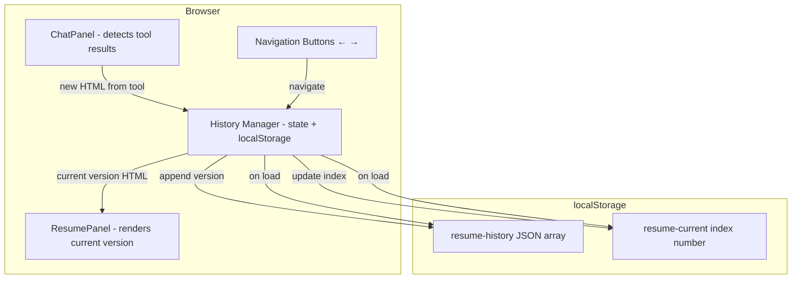
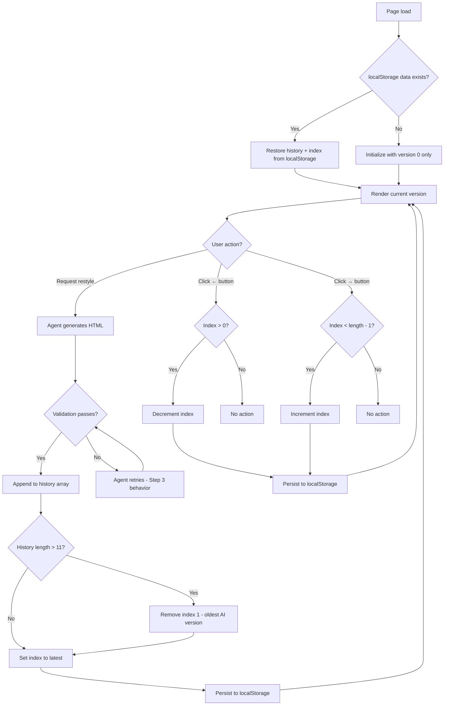

# Step 4 — Version History (Undo/Redo) (spec)

**Version:** v0.1  
**Date:** March 2026  
**Parent:** [implementation-plan.md](../implementation-plan.md) Step 4  
**Product context:** [joel-personal-site-overview.md](../joel-personal-site-overview.md)  
**Prerequisite:** [restyling-agent.md](./restyling-agent.md) (Step 3)

---

## 1. Goal

Add **version history navigation** to the left panel (resume preview). Every time the agent generates a new HTML restyle, snapshot it into a history store. Wire up the existing **← →** navigation buttons to let users step backward and forward through versions. Cap at **10 AI-generated versions** (FIFO pruning), and persist the **current version index** to `localStorage` so it survives page refreshes.

**What changes from Step 3:**

- Each successful restyle (validated HTML from `generate_resume_html` tool) is **saved** to a version history array.
- Version 0 (unstyled default HTML) is **always available** and does not count toward the 10-version limit.
- **← → buttons** in the left panel navigate through the history array.
- The **current version index** is persisted to `localStorage` and restored on page load.
- History is stored **client-side only** (localStorage) — no server-side state.

**Explicitly not in this step:** content guardrails (Step 5), external resume URL (Step 6).

---

## 2. Success criteria

- User requests a restyle → new HTML is validated and applied (Step 3 behavior).
- The new HTML is **automatically saved** as a new version in the history array.
- Clicking **←** navigates to the previous version; clicking **→** navigates to the next version.
- Buttons are **disabled** when at the start (version 0) or end (latest version) of history.
- When the user navigates to an old version and requests a **new restyle**, the new version is **appended to the end** of the history (maintains linear history).
- If the history array has 10 AI-generated versions and a new one is added, the **oldest AI-generated version** (index 1) is removed (FIFO, excluding version 0).
- On **page refresh**, the site displays the **last viewed version** (restored from `localStorage`).
- If `localStorage` is empty or corrupted, the site **falls back to version 0** (unstyled default).

---

## 3. Architecture



---

## 4. Data structures

### 4.1 Version history array

**Structure:**

```typescript
type VersionHistory = string[]; // Array of HTML strings

// Index 0: version 0 (unstyled default HTML, always present)
// Index 1+: AI-generated HTML versions in chronological order
```

**Example:**

```typescript
const versionHistory = [
  '<html>...</html>', // Index 0: unstyled default
  '<html>...</html>', // Index 1: first AI restyle (LinkedIn theme)
  '<html>...</html>', // Index 2: second AI restyle (terminal theme)
  '<html>...</html>', // Index 3: third AI restyle (newspaper theme)
  // ... up to index 10 (max 10 AI-generated versions + version 0)
];
```

### 4.2 Current version index

**Type:** `number`

**Semantics:**

- `0` = version 0 (unstyled default)
- `1` = first AI-generated version
- `2` = second AI-generated version
- etc.

**Range:** `0` to `versionHistory.length - 1`

---

## 5. localStorage schema

### 5.1 Keys

| Key               | Value Type     | Description                                                    |
| ----------------- | -------------- | -------------------------------------------------------------- |
| `resume-history`  | JSON string    | Stringified array of HTML strings (version history array)      |
| `resume-current`  | JSON string    | Stringified number (current version index)                     |

### 5.2 Example localStorage state

```javascript
localStorage.setItem('resume-history', JSON.stringify([
  '<html>...unstyled...</html>',       // version 0
  '<html>...linkedin theme...</html>',  // version 1
  '<html>...terminal theme...</html>',  // version 2
]));

localStorage.setItem('resume-current', JSON.stringify(2)); // viewing version 2
```

### 5.3 Persistence timing

**When to write:**

- **Immediately** when a new version is added (after successful restyle).
- **Immediately** when the user navigates to a different version (← → button click).

**Implementation:** Use `localStorage.setItem()` synchronously after state updates — no debouncing or `beforeunload` delays.

---

## 6. Version lifecycle

### 6.1 Adding a new version

**Trigger:** Agent successfully generates HTML via `generate_resume_html` tool (Step 3 validation passes).

**Behavior:**

1. Append the new HTML string to the end of `versionHistory` array.
2. If `versionHistory.length > 11` (version 0 + 10 AI versions), **remove index 1** (oldest AI-generated version).
3. Set `currentVersionIndex = versionHistory.length - 1` (jump to the newly added version).
4. Write updated `versionHistory` and `currentVersionIndex` to `localStorage`.
5. Render the new HTML in `ResumePanel`.

**FIFO pruning logic:**

```typescript
function addVersion(newHTML: string) {
  // Append new version
  versionHistory.push(newHTML);
  
  // Prune if exceeds limit (version 0 + 10 AI versions = 11 total)
  if (versionHistory.length > 11) {
    versionHistory.splice(1, 1); // Remove index 1 (oldest AI version, preserve version 0)
  }
  
  // Jump to latest
  currentVersionIndex = versionHistory.length - 1;
  
  // Persist
  persistToLocalStorage();
  
  // Render
  renderCurrentVersion();
}
```

**Note:** If the user is viewing an **old version** (e.g., index 2) and requests a new restyle, the new version is still **appended to the end** (maintains linear history). The user's view jumps to the new latest version.

### 6.2 Navigating versions

**Trigger:** User clicks **←** or **→** button.

**Behavior:**

- **← (previous):** Decrement `currentVersionIndex` by 1 (if `> 0`).
- **→ (next):** Increment `currentVersionIndex` by 1 (if `< versionHistory.length - 1`).
- Persist updated `currentVersionIndex` to `localStorage`.
- Render the HTML at the new index in `ResumePanel`.

**No wrapping:** Buttons do not wrap around (clicking ← at version 0 does nothing; clicking → at the latest version does nothing).

### 6.3 Initial load (page refresh)

**Behavior on page load:**

1. Read `resume-history` and `resume-current` from `localStorage`.
2. If both keys exist and are valid JSON:
   - Parse `resume-history` into `versionHistory` array.
   - Parse `resume-current` into `currentVersionIndex` number.
   - Render the HTML at `versionHistory[currentVersionIndex]`.
3. If keys are missing, corrupted, or invalid:
   - **Fallback to version 0:** Initialize `versionHistory = [unstyledDefaultHTML]`, `currentVersionIndex = 0`.
   - Render unstyled default HTML.
   - **Do not** persist fallback state immediately (only persist after user actions).

**No validation:** Trust the stored `currentVersionIndex` value (assume it's valid). If it's out of bounds (due to corruption), clamp to valid range: `Math.max(0, Math.min(currentVersionIndex, versionHistory.length - 1))`.

---

## 7. Navigation UI

### 7.1 Button placement

**Location:** The left panel (`ResumePanel`) already has **← →** buttons in the UI (confirmed by user). Wire these up to the version history navigation logic.

### 7.2 Button states

| Scenario                                    | ← Button State | → Button State |
| ------------------------------------------- | -------------- | -------------- |
| Viewing version 0 (start of history)        | Disabled       | Enabled (if versions exist) |
| Viewing an intermediate version (e.g., 2)   | Enabled        | Enabled        |
| Viewing the latest version (end of history) | Enabled        | Disabled       |
| Only version 0 exists (no AI versions yet)  | Disabled       | Disabled       |

**Disabled styling:** Grayed out or reduced opacity (match existing IDE design patterns).

**Empty state:** Buttons are **visible but disabled** when no AI-generated versions exist (only version 0 available).

### 7.3 No version indicator

**Decision:** Do **not** show a "Version X of Y" label or similar indicator. Button states (enabled/disabled) are sufficient feedback.

---

## 8. Integration with Step 3 (restyling)

### 8.1 ChatPanel changes

**Current behavior (Step 3):** `ChatPanel` extracts HTML from tool results and passes it to `ResumePanel` via state or prop.

**Step 4 changes:**

- Instead of directly passing HTML to `ResumePanel`, call a **history manager function** (e.g., `addVersion(newHTML)`).
- The history manager handles:
  - Appending to array
  - FIFO pruning
  - Updating `currentVersionIndex`
  - Persisting to `localStorage`
  - Triggering re-render

**Pseudocode:**

```typescript
// In ChatPanel (or parent component managing state)
useEffect(() => {
  const lastMessage = messages[messages.length - 1];
  if (lastMessage?.role === 'assistant') {
    for (const part of lastMessage.parts) {
      if (part.type === 'tool-generate_resume_html' && part.state === 'output-available') {
        const result = part.output;
        if (result.success && result.html) {
          // Step 4: Add to version history instead of directly setting state
          addVersionToHistory(result.html);
        }
      }
    }
  }
}, [messages]);
```

### 8.2 ResumePanel changes

**Current behavior (Step 3):** Receives `generatedHTML` prop and renders it in an iframe or falls back to unstyled default.

**Step 4 changes:**

- Change prop from `generatedHTML` (optional string) to `currentVersionHTML` (always a string).
- Add **← → button handlers** that call history navigation functions.
- Remove conditional logic for "no HTML yet" — always render the current version (version 0 is always available).

**Pseudocode:**

```typescript
interface ResumePanelProps {
  currentVersionHTML: string; // Always present (version 0 or AI-generated)
  onNavigatePrev: () => void;
  onNavigateNext: () => void;
  canNavigatePrev: boolean;
  canNavigateNext: boolean;
}

export function ResumePanel({
  currentVersionHTML,
  onNavigatePrev,
  onNavigateNext,
  canNavigatePrev,
  canNavigateNext,
}: ResumePanelProps) {
  return (
    <div>
      <nav>
        <button onClick={onNavigatePrev} disabled={!canNavigatePrev}>←</button>
        <button onClick={onNavigateNext} disabled={!canNavigateNext}>→</button>
      </nav>
      
      {/* Render current version (iframe or unstyled div based on content) */}
      {isUnstyled(currentVersionHTML) ? (
        <div dangerouslySetInnerHTML={{ __html: currentVersionHTML }} />
      ) : (
        <iframe
          sandbox="allow-scripts"
          srcDoc={currentVersionHTML}
          style={{ width: '100%', height: '100%', border: 'none' }}
          title="Restyled resume"
        />
      )}
    </div>
  );
}
```

---

## 9. History manager implementation

### 9.1 State management

**Approach:** Use **React state** in a parent component (e.g., `HomePage` or a context provider) to manage `versionHistory` and `currentVersionIndex`.

**Recommended structure:**

```typescript
// src/hooks/use-version-history.ts
import { useState, useEffect } from 'react';

const HISTORY_KEY = 'resume-history';
const CURRENT_KEY = 'resume-current';
const MAX_AI_VERSIONS = 10;

export function useVersionHistory(unstyledDefaultHTML: string) {
  const [versionHistory, setVersionHistory] = useState<string[]>([unstyledDefaultHTML]);
  const [currentVersionIndex, setCurrentVersionIndex] = useState(0);
  
  // Load from localStorage on mount
  useEffect(() => {
    try {
      const storedHistory = localStorage.getItem(HISTORY_KEY);
      const storedCurrent = localStorage.getItem(CURRENT_KEY);
      
      if (storedHistory && storedCurrent) {
        const parsedHistory = JSON.parse(storedHistory) as string[];
        const parsedCurrent = JSON.parse(storedCurrent) as number;
        
        // Clamp current index to valid range
        const clampedCurrent = Math.max(0, Math.min(parsedCurrent, parsedHistory.length - 1));
        
        setVersionHistory(parsedHistory);
        setCurrentVersionIndex(clampedCurrent);
      }
    } catch (err) {
      console.error('Failed to load version history from localStorage:', err);
      // Fallback to default (already initialized in state)
    }
  }, []);
  
  // Persist to localStorage whenever history or index changes
  useEffect(() => {
    try {
      localStorage.setItem(HISTORY_KEY, JSON.stringify(versionHistory));
      localStorage.setItem(CURRENT_KEY, JSON.stringify(currentVersionIndex));
    } catch (err) {
      console.error('Failed to persist version history to localStorage:', err);
    }
  }, [versionHistory, currentVersionIndex]);
  
  // Add a new version
  const addVersion = (newHTML: string) => {
    setVersionHistory((prev) => {
      const updated = [...prev, newHTML];
      
      // FIFO pruning: max 1 unstyled (index 0) + 10 AI versions = 11 total
      if (updated.length > MAX_AI_VERSIONS + 1) {
        updated.splice(1, 1); // Remove oldest AI version (index 1), preserve version 0
      }
      
      return updated;
    });
    
    // Jump to the newly added version
    setCurrentVersionIndex((prev) => {
      const newIndex = versionHistory.length; // Will be length after state update
      return newIndex;
    });
  };
  
  // Navigate to previous version
  const navigatePrev = () => {
    setCurrentVersionIndex((prev) => Math.max(0, prev - 1));
  };
  
  // Navigate to next version
  const navigateNext = () => {
    setCurrentVersionIndex((prev) => Math.min(versionHistory.length - 1, prev + 1));
  };
  
  // Current version HTML
  const currentVersionHTML = versionHistory[currentVersionIndex];
  
  // Navigation state
  const canNavigatePrev = currentVersionIndex > 0;
  const canNavigateNext = currentVersionIndex < versionHistory.length - 1;
  
  return {
    currentVersionHTML,
    addVersion,
    navigatePrev,
    navigateNext,
    canNavigatePrev,
    canNavigateNext,
    currentVersionIndex,
    totalVersions: versionHistory.length,
  };
}
```

### 9.2 Usage in parent component

```typescript
// src/app/page.tsx (or wherever ChatPanel and ResumePanel are rendered)
import { useVersionHistory } from '@/hooks/use-version-history';
import { ChatPanel } from '@/components/chat-panel';
import { ResumePanel } from '@/components/resume-panel';
import { unstyledResumeHTML } from '@/lib/resume'; // Version 0 source

export default function HomePage() {
  const {
    currentVersionHTML,
    addVersion,
    navigatePrev,
    navigateNext,
    canNavigatePrev,
    canNavigateNext,
  } = useVersionHistory(unstyledResumeHTML);
  
  return (
    <div className="two-panel-layout">
      <ResumePanel
        currentVersionHTML={currentVersionHTML}
        onNavigatePrev={navigatePrev}
        onNavigateNext={navigateNext}
        canNavigatePrev={canNavigatePrev}
        canNavigateNext={canNavigateNext}
      />
      
      <ChatPanel
        onNewVersionGenerated={addVersion} // Pass callback to ChatPanel
      />
    </div>
  );
}
```

---

## 10. Edge cases and error handling

| Case                                                         | Behavior                                                                                                 |
| ------------------------------------------------------------ | -------------------------------------------------------------------------------------------------------- |
| User navigates to old version and requests new restyle      | New version is appended to the end; user jumps to the new latest version (maintains linear history).     |
| localStorage quota exceeded                                  | Log error to console; history updates continue in memory but won't persist. Consider notifying user.     |
| localStorage is disabled (privacy mode)                      | History works in-session but won't persist across page refreshes (graceful degradation).                 |
| Corrupted localStorage data (invalid JSON)                   | Fall back to version 0 (unstyled default), clear corrupted keys, start fresh.                           |
| `currentVersionIndex` out of bounds (due to corruption)      | Clamp to valid range: `Math.max(0, Math.min(index, versionHistory.length - 1))`.                        |
| User clicks ← when already at version 0                      | Button is disabled; click has no effect.                                                                 |
| User clicks → when already at latest version                 | Button is disabled; click has no effect.                                                                 |
| Multiple tabs open (localStorage sync)                       | Each tab maintains independent state; changes in one tab do not sync to others (acceptable for MVP).     |
| Version 0 HTML changes (e.g., resume content updated)        | On next page load, version 0 is re-initialized with new content; old version 0 is lost (acceptable).    |

---

## 11. Testing checklist (manual)

### 11.1 Basic navigation

- Request a restyle (Step 3 behavior) → verify new version is added and displayed.
- Click **←** → verify previous version is displayed.
- Click **→** → verify next version is displayed.
- Verify ← button is **disabled** when at version 0.
- Verify → button is **disabled** when at the latest version.

### 11.2 Adding versions

- Generate **3 restyle versions** in sequence.
- Verify history contains: version 0 + 3 AI versions (4 total).
- Navigate to version 1 (← ← from latest).
- Request a **new restyle** → verify new version is appended to the end (becomes index 4).
- Verify user jumps to the new version (index 4).

### 11.3 FIFO pruning

- Generate **10 AI-generated versions** (history should have 11 total: version 0 + 10 AI).
- Generate an **11th AI version** → verify the oldest AI version (original index 1) is removed.
- Navigate through history → verify version 0 is still present, oldest AI version is gone.

### 11.4 Persistence

- Generate 2-3 versions.
- Navigate to an intermediate version (e.g., version 1).
- **Refresh the page** → verify version 1 is still displayed (restored from localStorage).
- Open **DevTools → Application → localStorage** → verify `resume-history` and `resume-current` keys exist.

### 11.5 Error handling

- Manually corrupt `resume-history` in localStorage (set to invalid JSON).
- Refresh page → verify fallback to version 0, no crash.
- Manually set `resume-current` to an out-of-bounds index (e.g., `99`).
- Refresh page → verify index is clamped to valid range.

### 11.6 Empty state

- Clear localStorage (or use incognito mode).
- Load site → verify only version 0 exists.
- Verify ← and → buttons are **visible but disabled**.
- Generate a restyle → verify → button becomes enabled.

---

## 12. Performance considerations

- **localStorage read:** Happens once on page load (acceptable latency).
- **localStorage write:** Happens immediately after version changes (synchronous, fast for small HTML strings).
- **Memory footprint:** 11 HTML strings in memory (version 0 + 10 AI versions). Assuming ~50KB per HTML string → ~550KB total (acceptable for client-side state).
- **Rendering:** Only the current version is rendered in the iframe (no performance impact from history size).

**Optimization opportunities (future):**

- Compress HTML strings before storing in localStorage (e.g., LZ-string library).
- Store only diffs instead of full HTML (more complex, defer unless needed).

---

## 13. Accessibility

- **← → buttons:** Must have accessible labels (e.g., `aria-label="Previous version"`, `aria-label="Next version"`).
- **Disabled state:** Use `aria-disabled="true"` for screen reader feedback.
- **Keyboard navigation:** Ensure buttons are keyboard accessible (default button behavior).
- **Focus management:** When navigating versions, consider announcing the change to screen readers (optional for MVP; could use live region).

---

## 14. Dependencies

| Package | Purpose | Install command |
| ------- | ------- | --------------- |
| None    | No new dependencies required | - |

**Rationale:** Version history uses React state + `localStorage` API (native browser API, no library needed).

---

## 15. File / area touch list (expected)

| Area                                                  | Action                                                                                   |
| ----------------------------------------------------- | ---------------------------------------------------------------------------------------- |
| `src/hooks/use-version-history.ts` (new)             | Implement version history state management, localStorage persistence, navigation logic.   |
| `src/components/resume-panel.tsx`                    | Add ← → button handlers, change prop from `generatedHTML?` to `currentVersionHTML`.      |
| `src/components/chat-panel.tsx`                      | Pass `addVersion` callback instead of directly setting state for new HTML.                |
| `src/app/page.tsx` (or parent layout component)      | Wire up `useVersionHistory` hook, pass callbacks and state to child components.           |
| `src/lib/resume.ts` (or existing resume source file) | Export `unstyledResumeHTML` as the canonical version 0 source.                            |

---

## 16. Clarifications & design decisions

### Version 0 source (RESOLVED)
**Decision:** Version 0 HTML is the **unstyled resume HTML** from the canonical resume source (same as Step 2/3 default).
- **Initialization:** On first load, `versionHistory` is initialized with `[unstyledResumeHTML]`.
- **Persistence:** Version 0 is stored in localStorage as index 0 of the history array.
- **Updates:** If the resume content changes (e.g., Joel updates the markdown file), version 0 is re-initialized on next page load with the new content. Old version 0 in localStorage is overwritten (acceptable — version 0 is not meant to be historical).

### Linear vs. branching history (RESOLVED)
**Decision:** **Linear history only** (append-always strategy).
- When a user navigates to an old version and requests a new restyle, the new version is appended to the end.
- No branching or "discard future versions" behavior.
- Rationale: Simpler UX and implementation; matches common undo/redo patterns.

### localStorage key structure (RESOLVED)
**Decision:** Two keys:
- `resume-history`: JSON array of HTML strings.
- `resume-current`: JSON number (index).
- Rationale: Simpler than per-version keys; single read/write per operation.

### Multi-tab sync (OUT OF SCOPE)
**Decision:** No cross-tab synchronization in Step 4.
- Each tab maintains independent state.
- Changes in one tab do not appear in other tabs until refresh.
- Rationale: Requires `storage` event listeners and conflict resolution; defer to future iteration if needed.

### Compression (OUT OF SCOPE)
**Decision:** Store raw HTML strings without compression in Step 4.
- If localStorage quota becomes an issue during testing, revisit with LZ-string or similar.
- Rationale: Premature optimization; 11 × 50KB HTML strings = ~550KB, well below typical 5-10MB localStorage limits.

---

## 17. Open questions / future work

- **Step 5:** Content guardrails — PG filter, off-topic redirects, friendly refusals.
- **Step 6:** External resume URL — fetch from GitHub raw or S3 instead of bundled file.
- **Future:** Cross-tab sync (storage events), version metadata (timestamps, theme descriptions), compression (if localStorage quota is exceeded).

---

## 18. Risks and mitigations

| Risk                                                          | Mitigation                                                                                                 |
| ------------------------------------------------------------- | ---------------------------------------------------------------------------------------------------------- |
| localStorage quota exceeded (HTML strings too large)          | Log error, continue in-memory only (graceful degradation). Consider compression if issue arises.           |
| User generates many versions quickly (rapid clicks)           | FIFO pruning ensures max 11 versions; no unbounded growth.                                                 |
| Index state desync between React state and localStorage      | Use `useEffect` with dependencies to ensure writes happen after state updates; trust single source of truth. |
| User expects version history to persist across devices/browsers | Not supported; version history is per-browser/device (localStorage limitation). Document if needed.         |
| Slow localStorage writes block UI                            | localStorage writes are synchronous but fast (<10ms for small JSON). Monitor if latency issues arise.      |

---

## 19. Non-functional requirements

- **Performance:** Navigation between versions should be instant (<100ms) since it's just updating state and re-rendering.
- **Storage:** Version history should not exceed 2MB total (well within typical 5-10MB localStorage limits).
- **Accessibility:** Navigation buttons must be keyboard accessible and screen-reader friendly.
- **Browser support:** Modern browsers with localStorage support (Chrome, Firefox, Safari, Edge). No IE11 support required.

---

## 20. Definition of Done

- `useVersionHistory` hook is implemented with all documented functions and localStorage integration.
- `ResumePanel` renders current version HTML and wires up ← → button handlers.
- `ChatPanel` calls `addVersion` when a new restyle is generated (Step 3 integration).
- Version 0 (unstyled default) is always available and does not count toward 10-version limit.
- FIFO pruning removes oldest AI-generated version when limit is exceeded (index 1 is removed, version 0 preserved).
- localStorage persistence works: current version is restored on page refresh.
- Corrupted localStorage gracefully falls back to version 0.
- ← → buttons are disabled appropriately (at start/end of history).
- Manual testing checklist (§11) is complete.
- No version indicator label is shown (decision per product spec clarifications).
- History navigation does not wrap around (buttons disabled at boundaries).

---

## 21. Example user flow

### Scenario: User generates 3 versions and navigates history

1. **Initial load:** User opens site → sees unstyled resume (version 0) → ← → buttons are disabled (no AI versions yet).
2. **First restyle:** User requests "Make it look like LinkedIn" → new HTML is generated and applied → history now has 2 versions (version 0 + version 1) → → button is disabled (at latest), ← button is enabled.
3. **Second restyle:** User requests "Make it look like a terminal" → new HTML is generated and applied → history now has 3 versions → → button is disabled (at latest), ← button is enabled.
4. **Navigate back:** User clicks **←** → sees version 1 (LinkedIn theme) → both buttons are enabled.
5. **Navigate back again:** User clicks **←** → sees version 0 (unstyled) → ← button is disabled, → button is enabled.
6. **Navigate forward:** User clicks **→** → sees version 1 (LinkedIn theme).
7. **New restyle from old version:** User requests "Make it look like a newspaper" while viewing version 1 → new HTML is generated and appended as version 3 → user jumps to version 3 → history is now: version 0, version 1 (LinkedIn), version 2 (terminal), version 3 (newspaper).
8. **Page refresh:** User refreshes the page → site loads at version 3 (newspaper theme, restored from localStorage).

---

## 22. Diagram: Version history lifecycle


